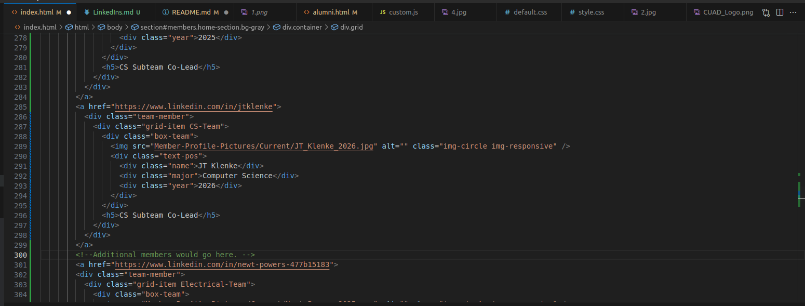

# Updating and Maintaing Our Website

If you're reading this right now, it's safe to assume you've been assigned
to maintain this website.

Lucky you! :moyai:

Assuming I've done my job right, most of the work would entail keeping the
members tab current and up-to-date, along with moving graduated members to
the Alumni section of the website. From one guy who knows nothing about
front-end development to someone who hopefully knows a hell of a lot more, 
below are the main things you'll have to keep updated, and how to go about it.

Read over the whole thing, and if you still have questions ask your lead.

## Getting Started

Make sure to clone this git repo to your machine to work on it, or do whatever
else you would do in order to edit this from your machine. If you don't know
what this means, ask the CS Leads. They would hopefully know? If not... Google.

When you commit, you must commit to the staging branch. Do NOT commit directly
to master. Commit to staging, open a PR and have the CS Leads look at it first.
As a matter of fact, only the CS Leads should ever merge a PR to master. 
If you don't know what this means... ask the CS Leads. 

If you are working with multiple people, feel free to create your own
branches to work independently, and then make PRs to merge to staging. 

***MAKE YOUR COMMIT MESSAGES DETAILED.*** I (and many others) will throw
a massive fit if you make a large commit to staging with little to no
message explaining what you did (I'm looking at you, commit [b582f0f](https://github.com/CUAerialRobotics/CUAerialRobotics.github.io/commit/b582f0f30a11ba71021ae584dd7ef26a850c210f))

Make the commit messages you write in the following format:
```
Main Change/Overall Theme

- More details about the changes
- Use as many of these as you deem necessary
```

We prefer overly-detailed to under-detailed. While there is an art to it,
do the best you can in providing enough information while not inundating
the reader. For more specifics the reader can look at the code changes 
themselves. 

## Adding Members to the Website
To add a member to the website, you will need the following info:
- Picture
- Name
- Major
- Subteam
- Year of Graduation
- LinkedIn
- Any additional titles (lead, etc.)

Place the image of the member in the directory
```Member-Profile-Pictures/Current```

The HTML for a member looks like this. You would replace this example with
the info of this specific member:
```HTML
        <a href="*Link to LinkedIn goes here*">
        <div class="team-member">
          <div class="grid-item *Insert Team Name*-Team">
            <div class="box-team wow bounceInUp"> 
                <!--If this animation is removed in the future, 
                this is just "box-team"-->
              
              <div class="text-pos">
                <div class="name">*Insert Name*</div>
                <div class="major">*Insert Major*</div>
                <div class="year">*Insert Year of Graduation*</div>
              </div>
            </div>
            <h5>*Insert addtl titles*</h5> 
            <!--If this member has no additional titles, 
            this line can be removed-->
          </div>
        </div>
        </a>
```

This can be copy-pasted into the HTML for the website.
Update it with the information of the member you are adding to the website.

If you are missing the LinkedIn, for the members section specifically
you should write 
```#members```
as a placeholder. Once you receive their LinkedIn, replace it.

As for where to insert it:


Obviously, over time that exact position would change, but it should remain
fairly obvious where to insert new members. It would be at that same location,
just after the /a that closes the "team-member" class.

## Moving Graduates to the Alumni Section

Graduation is a bittersweet time for many. A pivotal chapter in your life
comes to a close, _and it is no longer acceptable to be drunk in public._ 

Despite any pleas and appeals, we are an undergraduate organization. 
While people doing their MEng are welcome to stick around and help, as far
as we are concerned they are alumni and need to be moved to that section
of the website for the sake of book-keeping.

This is a relatively simple task. The alumni section is verbatim copied
from the members section on the main site. This is done intentionally. 
If the way members are presented on the main site changes, this must
change too. 

For starters, move the member's image from
```Member-Profile-Pictures/Current```
to
```Member-Profile-Pictures/Alumni```

The HTML of an alumni is largely the same. This should be a quick
copy from the website, change some things, and paste job:
```HTML
        <a href="*Link to LinkedIn goes here*">
        <div class="team-member">
          <div class="grid-item *Insert Team Name*-Team">
            <div class="box-team">
              
              <div class="text-pos">
                <div class="name">*Name*</div>
                <div class="major">*Major*</div>
                <div class="year">*Year of Graduation*</div>
              </div>
            </div>
            <h5>*Title AND Years Held*</h5> 
            <!--Like before, if this member had no additonal 
            titles this can be removed.-->
          </div>
        </div>
        </a>
```

The only major distinction is that their image must be in the alumni image
directory, and the title they hold **MUST** be accompanied by the years
that they filled that role. 

The placeholder for missing LinkedIn information changes. 
You have two options:

- Remove the ability to click on their page
- Go to the top of the Alumni page

Either or is fine, but I imagine the former would be much easier to implement.
Just remove the a and /a. 

The latter is a bit more consistent as it means every alumni would be clickable
in some fashion. This I will leave to your and the current CS and Business
leads discretion. For now, I will implement the former. 

Like with members, the location to insert another Alumni would be directly
after the /a that closes the previous Alumni entry. 

### CUAD History Lesson

Feel free to skip ahead if this is boring to you.
The section of alumni is missing a lot of people. 

A bit of CUAD history here:

Before we became a project team, we were a club known as ARC:
Aerial Robotics at Cornell.
Depending on when you read this, this is either a very recent memory or
new information. In 2020, the club essentially went dormant due to a variety
of factors, including COVID and a lack of members as many had graduated. 

Enter the 2020 Lead Staff. 

They essentially took this club, pulled it out of its grave, and made it what
it is today. All their efforts have culminated here, with you reading this
verbose and overly-complicated readme. They'd be so proud... :sob:

However, as a result of this, a lot of the information on members from around
the founding of the club in 2017 until around 2023 is very incomplete and
scattered. There is also a commit to blame that removed all the old members
from the website. While sure, the images are still accessible thanks to Git
providing great version control, some data is still missing. 

On the website, there is a note telling alumni not present to 
contact us to be featured. That's where you come in!

## Adding "new" Alumni

If an alumni has requested to be featured on the website, make sure they have
sent the following information to our email:
- Picture
- Name
- Major
- Subteam
- Year of Graduation
- LinkedIn (for alums this is optional)
- Any additional titles (lead, etc.)

If any info is missing feel free to email them back asking for this info.

These requests to be added to the website can be taken at face value, 
but if you really want to check you can check the slack or the campusgroups.
Very few people ever properly leave those, so it's very likely information 
is still there. Either way, the world isn't out to get you. Unless it's 
obviously fake or conflicts with data we have, it's safe to take these
requests at face value. 

Take the following HTML template (same as above), and add their info:
```HTML
        <a href="*Link to LinkedIn goes here*">
        <div class="team-member">
          <div class="grid-item *Insert Team Name*-Team">
            <div class="box-team">
              
              <div class="text-pos">
                <div class="name">*Name*</div>
                <div class="major">*Major*</div>
                <div class="year">*Year of Graduation*</div>
              </div>
            </div>
            <h5>*Title AND Years Held*</h5> 
            <!--Like before, if this member had no additonal 
            titles this can be removed.-->
          </div>
        </div>
        </a>
```

Exactly like above, this should be inserted after the /a that closes
the "team-member" class of a previous entry. 

Do your best to put Alumni in order of graduation year, and if they can then
further be sorted by team even better. But, just by graduation year is fine.

## To-Do

This website is very old, and is built on some pretty old accompanying code.
I don't know the first thing about front-end development, so if you
do feel free to add to this list how you see fit. However, from the things
I can discern/the work I've done so far, the following needs to be finished:

- [ ] Get NavBar working on Alumni Page
- [ ] Address why you need to open a new tab to access alumni page
(This might be a local issue??)
- [ ] Fix mobile site 
- [ ] Removing Caurosel for Team Introductions (it looks like horseshit)
- [ ] Improving performance - This can likely be accomplished by cutting down
on the amount of animations. 
- [ ] Updating js files (bootstrap 3 LMAO) 
This should only be done if you really know what you're doing. If you're like
me, this can go unaddressed for the time being. 
- [ ] Moving this to its own domain (CUAD.org ????)

Of course, make sure to check in with your lead to see if anything else needs
to be accomplished with the website. 

### Acknowledgements

I'd like to give a special thank you to the 2021-2022 lead staff for inspiring
my deep passion for Aerial Robotics, for always being so warm and
welcoming, and for providing some unforgettable nights in the form 
of team socials. 

I'd also like to thank the leads I'm working with now in 2023-2024 for being so
diligent and for sharing the same passion I have. 

To the future leads of this team - thank you for keeping our dream alive.

And to you, the poor sucker in charge of this website - Thank you for 
all of your efforts and hard work. 

### Author

This readme was written by Santiago Blaumann. 


